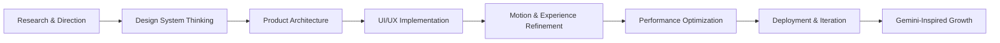

<div align="center">

# アクシャイ公式 | AKSHAY OFFICIAL
### Industrial Cyber-Tech Command Center

[](https://nextjs.org/)
[](https://www.typescriptlang.org/)
[](https://tailwindcss.com/)
[](https://www.framer.com/motion/)
[](https://vercel.com/)
[](https://deepmind.google/)

</div>

<p align="center">
  
</p>

<div align="center">

> Welcome to my official GitHub profile & portfolio — where engineering precision meets futuristic product thinking.
> 公式ポートフォリオへようこそ — 精密な設計と未来志向の技術で、次世代のデジタル体験を構築しています。

</div>

---

## [](https://github.com/AkshayManojkp/AKSHAYOFFICIAL) Core Architecture & System Stack

A performance-first digital ecosystem designed for exceptional UI craft, rapid experimentation, and intelligent product execution.

- Framework: Next.js (App Router)
- Language: TypeScript
- Styling & Design System: Tailwind CSS
- Motion & Interaction Layer: Framer Motion
- Deployment Platform: Vercel
- AI Intelligence Layer: Gemini-powered experimentation & adaptive product thinking

```ts
const akshayOfficial = {
  focus: ["precision", "performance", "future-ready UI"],
  stack: ["Next.js", "TypeScript", "Tailwind CSS", "Framer Motion"],
  deployment: "Vercel",
  intelligence: "Gemini AI",
  mission: "Build elegant digital systems with measurable impact"
};
```

---

## [](https://github.com/AkshayManojkp/AKSHAYOFFICIAL) Mission, Vision & Scope

> Updates and new implementation experiments over website with Precision Intelligence Model "GEMINI".
> Built for high performance, futuristic UI aesthetics, and continuous learning & self-development.

### Strategic Pillars

- High-performance engineering with modern web architecture
- Futuristic interfaces that balance design clarity and product utility
- Continuous experimentation with intelligent system design
- Growth-driven learning through iteration, refinement, and execution

### Operating Philosophy

- Build with clarity
- Ship with precision
- Optimize for experience
- Evolve through intelligent iteration

---

## [](https://github.com/AkshayManojkp/AKSHAYOFFICIAL) System Capabilities

<div align="left">

- Advanced front-end architecture using Next.js App Router
- Responsive and aesthetic design systems with Tailwind CSS
- Fluid motion design and micro-interaction patterns with Framer Motion
- Product-first experimentation for immersive digital experiences
- AI-enhanced ideation and development direction using Gemini integration

</div>

---

## [](https://github.com/AkshayManojkp/AKSHAYOFFICIAL) Workflow Pattern



---

## [](https://github.com/AkshayManojkp/AKSHAYOFFICIAL) Focus Areas

- Next-generation portfolio experiences
- Industrial cyber-tech storytelling
- Futuristic product design systems
- High-end web experiences with measurable polish
- Continuous self-improvement through technical depth

---

<div align="center">

[](https://deepmind.google/)

</div>

<p align="center">
  
  
</p>

---

<p align="center">
  <i>Crafting digital systems that look advanced, perform sharply, and evolve intelligently.</i>
</p>
