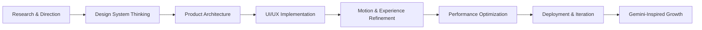

# アクシャイ公式 | AKSHAY OFFICIAL
### Industrial Cyber-Tech Command Center

  

> Welcome to my official GitHub profile & portfolio — engineered for precision, clarity, and futuristic product experiences.
> 公式ポートフォリオへようこそ — 精密性、明確さ、そして未来志向のデジタル体験を追求する設計の場です。

---

##  Core Architecture & System Stack

The foundation is built around performance-first engineering, intelligent product thinking, and a premium interface layer that feels crafted rather than generic.

- Framework: Next.js (App Router)
- Language: TypeScript
- Styling & Design System: Tailwind CSS
- Motion & Interaction Layer: Framer Motion
- Hosting Platform: Vercel
- Intelligence Layer: Gemini AI experimentation and product-driven innovation

---

##  Mission, Vision & Scope

> Updates and new implementation experiments over website with Precision Intelligence Model **"GEMINI"**.
> Built for high performance, futuristic UI aesthetics, and continuous learning & self-development.

### Strategic Pillars

- High-performance engineering with modern web architecture
- Futuristic interfaces balancing aesthetics, usability, and precision
- Continuous experimentation through intelligent product iteration
- Self-development through technical depth, system thinking, and execution

### Operating Philosophy

- Build with clarity
- Ship with precision
- Optimize for experience
- Evolve through intelligent iteration

---

##  System Capabilities

- Advanced front-end architecture using Next.js App Router
- Elegant, responsive UI systems with Tailwind CSS
- Motion-rich product storytelling with Framer Motion
- AI-assisted experimentation and strategic digital direction
- Premium web experiences designed for clarity, trust, and impact

---

##  Workflow Pattern

---

##  High-Value Focus Areas

- Next-generation portfolio experiences
- Industrial cyber-tech storytelling
- Futuristic product design systems
- High-end web experiences with measurable polish
- Continuous self-improvement through technical depth

---

##  GitHub Presence

 

---

  
  
  

---

  <i>Crafting digital systems that look advanced, perform sharply, and evolve intelligently.</i>

